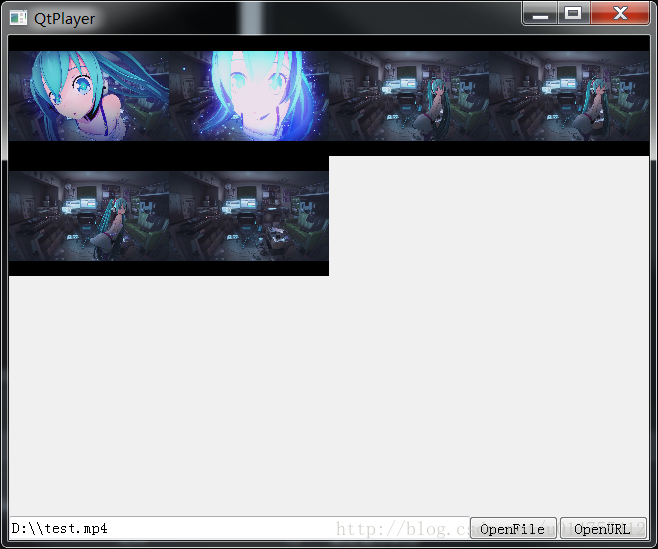

# QtPlayer

## Preview

## Introduction

- **A sample multi-screen media player.**
- **Support to view up to 16 videos at the same time.**
- **Support both local file, rtsp and rtmp media stream.**
- **Used VS2015, Qt and VLC**
- **It's a demo.**

## Compile

### Windows

- 1) Install VS2015 or VS2017.
- 2) Install Qt.
- 3) Install "Qt VS tools" (https://download.qt.io/archive/vsaddin/qt-vs-tools-msvc2015-2.1.1.vsix).
- 4) Configure Qt path in Visual Studio.
- 5) Open "QtPlayer.sln" with VS, build and run it.

### ~~Linux~~

